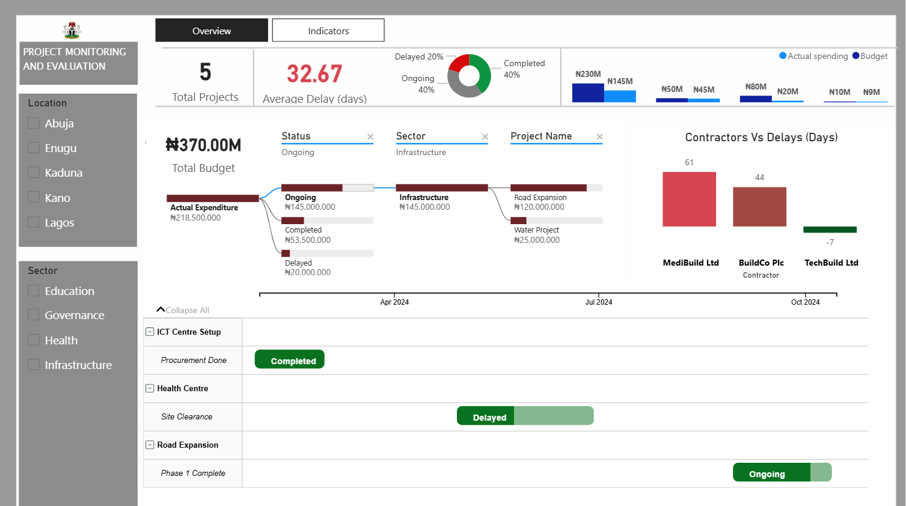

# Portfolio
<!--Section 1: Introduce your self-->
## ABOUT ME

Hello! My name is Retji 🤓, a microsoft certified data analyst, teacher, and consultant with a passion for data & public policy. With experience across education, energy and public service, I help organisations solve challenges and unlock growth through data and strategic planning.

<!--Mention your top/relevant skills here - core and soft skills-->
## WHAT I DO

*I am a Planning & Analytics officer currently in the Office of the Head of the Civil Service of the Federation, Nigeria. I use my skillsets to help drive policy actions through analytics. I do offer free training services to data community at my leisure time*

**- ✅ Data Analytics Consulting.**
I provide in-depth analysis and tailored solutions to help you make data-driven decisions, optimize processes, and drive business growth. 

**- ✅ Training & Development.**
I offer comprehensive training programs in data analysis, visualization, and data-driven decision-making. From beginner to advanced levels. 

## SKILLS
✅Excel  ✅PowerBI  ✅SQL  ✅PowerApps

<!--Section 2: List 3-4 key projects-->
## MY PORTFOLIO 

*A glimpse of some of the projects I've been working on.*

**1.  Project Monitoring & Evaluation Dashboard**

As a Planner engaged in the oversight of multiple government and organizational initiatives, I designed and developed a comprehensive Project Monitoring and Evaluation (M&E) Dashboard in Microsoft Power BI. This solution was created to enhance transparency, accountability, and decision-making by providing stakeholders with real-time insights into project implementation, financials, and performance indicators.

**🎯 Objectives**
- Track the execution of capital projects and programmes across multiple sectors and locations.
- Monitor budget vs. actual expenditure to identify cost overruns or underspending.
- Measure project progress against predefined indicators (e.g., completion rates, milestones).
- Provide decision-makers with actionable intelligence for improved planning, resource allocation, and performance management.

**📊 Key Features of the Dashboard**

_KPI Summary Cards_: Quick insight into total projects, percentage completed on time, budget utilization, and average delays.
_Financial Tracking_: Budget vs. actual expenditure visualized across sectors and projects, highlighting variances.
_Project Status Monitoring_: Breakdown of projects by status (Completed, Ongoing, Delayed) with drillthrough capability.
_Contractor Performance Analysis_: Comparison of contractors against project delays, enabling accountability and performance benchmarking.
Geospatial Mapping: Interactive filters by location (states/LGAs) and sectors to evaluate project distribution.

_Milestone Tracker_: Gantt-style timeline visualization showing planned vs. actual milestone delivery dates.

_M&E Indicators_: Target vs. achieved values displayed in a progress-style chart, ensuring that development outcomes are measurable and transparent.

**⚙️ Technical Implementation**

Built data models integrating Projects, Indicators, and Milestones tables with well-defined relationships.
Created DAX measures for KPIs including cost variance, percentage achieved, and project delays.
Applied conditional formatting and custom visuals to highlight progress, risks, and underperformance.
Implemented hierarchical drilldowns (from sector → project → milestone) for multi-level performance insights.
Designed for scalability and reusability, enabling adoption across diverse organizations and project portfolios.

**💡 Business Impact**

This dashboard transforms raw project and financial data into an intuitive, interactive performance management tool. It empowers leadership to:
Detect and resolve bottlenecks early.
- Hold contractors accountable.
- Optimize budget utilization.
- Ensure evidence-based planning and evaluation of government and donor-funded programmes.

✅ Portfolio Value:

This project demonstrates my expertise in data modeling, DAX, visualization design, and monitoring & evaluation analytics — skills that are highly transferable to roles in data analysis, business intelligence, and project management analytics across both public and private sector organizations.

[Read More and Interract with the PowerBI Report](https://app.powerbi.com/view?r=eyJrIjoiYjkxM2QzMDUtY2JjMi00MzEyLTk4Y2YtODQwZjBjMDRiMDc0IiwidCI6ImMwYzM4MjczLWRhYzMtNGQyMi1iNWEzLTNhZTE3ZTgxZWY0MCJ9&embedImagePlaceholder=true)

**2. Kema Bank Customers Onboarding Campaign Report.**

This Power BI report provides an interactive and data-driven visualization of (Wema Bank customer onboarding report for the year 2023 that captures customer demographics, sales performance, financial analysis, project monitoring, etc.).

[Read More and Interract with the PowerBI Report](https://app.powerbi.com/view?r=eyJrIjoiZGQ4NTc3NGUtYzhlOC00ZmNlLTllZGYtMDg4MWM4YWQxN2I3IiwidCI6ImMwYzM4MjczLWRhYzMtNGQyMi1iNWEzLTNhZTE3ZTgxZWY0MCJ9)

**3. Paw & Hearts Animal Shelter Solutions (PowerApp & PowerBI)**

This project was developed as part of a Microsoft Power Platform challenge focused on enhancing operations for Paw & Heart, an animal rescue organization. The solution aims to streamline 📝 animal record-keeping, facilitate support for foster families 🏡, and provide insights 📊 to promote pet fostering. The project involved leveraging Microsoft Power Platform tools to address key requirements for the shelter, including data management, process automation, and reporting.

[Read More](https://app.powerbi.com/view?r=eyJrIjoiOWU3MmEwZGQtNDQxYS00ZTRiLWI2ZTgtOTBlNDg1NTI1ODk0IiwidCI6ImM4MzgxNmI2LWJhMjAtNGQ0Mi05YzQyLWFiMzAyODczOTM5MSJ9)

**4. A-Process-Dashboard-of-Samari-Company-Using-Excel**

This project involved data cleaning, pivot table creation, and dashboard design for a fictitious company called Samari Packaging Company. The company has two types of workers, Checkers and Packagers, and their work hours were recorded using time_in and time_out data.

The goal of this project was to calculate the number of hours worked each day, the number of packaged items by each Packager, and the number of checked packaged items by each Checker. The project also aimed to calculate the pay for each worker based on their work hours and the number of items produced or checked.

[Read More](https://github.com/Retji/A-Process-Dashboard-of-Samari-Company-Using-Excel)

## CONTACT DETAILS

*Let’s connect and see how we can make a difference together!*
<table>
  <tbody>
    <tr>
      <td>📧</td>
      <td><a href="mailto:retjidakon@yahoo.com">retjidakon@yahoo.com</a></td>
    </tr>
    <tr>
      <td>📞</td>
      <td>(+234) 806-511-7781</td>
    </tr>
    <tr>
      <td>📍</td>
      <td>Abuja, Nigeria</td>
    </tr>
    <tr>
      <td>⬇️</td>
      <td><a href="RETJI JOSIAH CV.pdf">Download my CV</a></td>
    </tr>
    <tr>
      <td>💌</td>
      <td><a href="Certificates.pdf">Download my Certificates</a></td>
    </tr>
    <tr>
      <td>🌐</td>
      <td><a href="https://linkedin.com/retji-dakon">The things I do daily on LinkedIn</a></td>
    </tr>
  </tbody>
</table>

   

