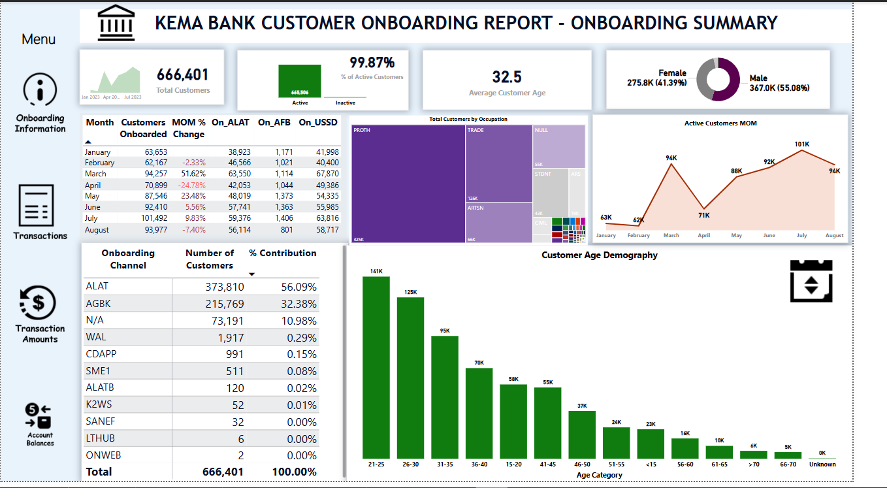
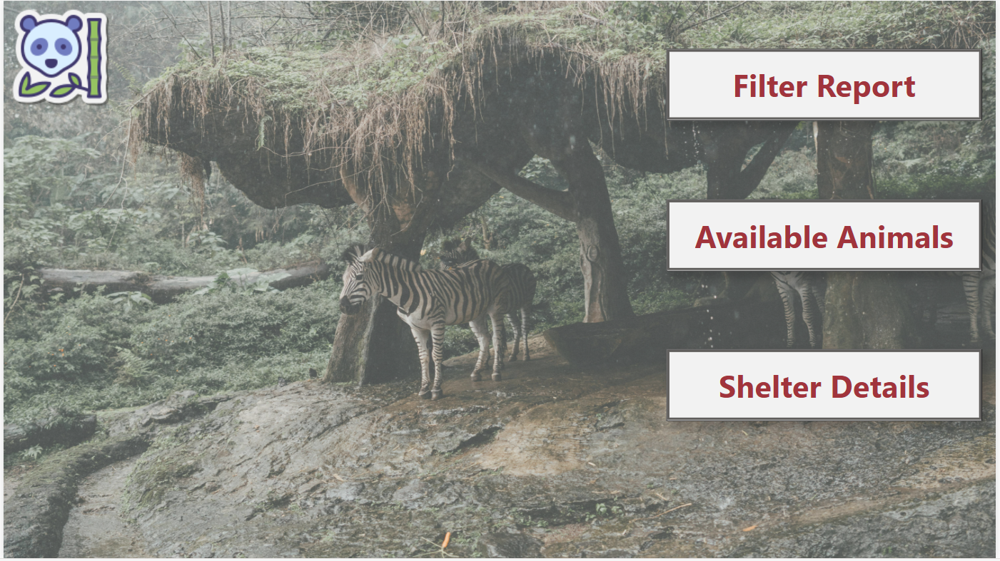

# Portfolio
<!--Section 1: Introduce your self-->
## ABOUT ME

Hello! My name is Retji 🤓, a microsoft certified data analyst, teacher, and consultant with a passion for data & public policy. With experience across education, energy and public service, I help organisations solve challenges and unlock growth through data and strategic planning.

<!--Mention your top/relevant skills here - core and soft skills-->
## WHAT I DO

*I am a Planning & Analytics officer currently in the Office of the Head of the Civil Service of the Federation, Nigeria. I use my skillsets to help drive policy actions through analytics. I do offer free training services to data community at my leisure time*

**- ✅ Data Analytics Consulting.**
I provide in-depth analysis and tailored solutions to help you make data-driven decisions, optimize processes, and drive business growth. 

**- ✅ Training & Development.**
I offer comprehensive training programs in data analysis, visualization, and data-driven decision-making. From beginner to advanced levels. 

## SKILLS
✅Excel  ✅PowerBI  ✅SQL  ✅PowerApps

<!--Section 2: List 3-4 key projects-->
## MY PORTFOLIO 

*A glimpse of some of the projects I've been working on.*

**Kema Bank Customers Onboarding Campaign Report.**

This Power BI report provides an interactive and data-driven visualization of (Wema Bank customer onboarding report for the year 2023 that captures customer demographics, sales performance, financial analysis, project monitoring, etc.).

[Read More and Interract with the PowerBI Report](https://app.powerbi.com/links/3896n8MlcU?ctid=c0c38273-dac3-4d22-b5a3-3ae17e81ef40&pbi_source=linkShare)

**Paw & Hearts Animal Shelter Solutions (PowerApp & PowerBI)**

This project was developed as part of a Microsoft Power Platform challenge focused on enhancing operations for Paw & Heart, an animal rescue organization. The solution aims to streamline 📝 animal record-keeping, facilitate support for foster families 🏡, and provide insights 📊 to promote pet fostering. The project involved leveraging Microsoft Power Platform tools to address key requirements for the shelter, including data management, process automation, and reporting.

[Read More](https://app.powerbi.com/view?r=eyJrIjoiOWU3MmEwZGQtNDQxYS00ZTRiLWI2ZTgtOTBlNDg1NTI1ODk0IiwidCI6ImM4MzgxNmI2LWJhMjAtNGQ0Mi05YzQyLWFiMzAyODczOTM5MSJ9)

**A-Process-Dashboard-of-Samari-Company-Using-Excel**

This project involved data cleaning, pivot table creation, and dashboard design for a fictitious company called Samari Packaging Company. The company has two types of workers, Checkers and Packagers, and their work hours were recorded using time_in and time_out data.

The goal of this project was to calculate the number of hours worked each day, the number of packaged items by each Packager, and the number of checked packaged items by each Checker. The project also aimed to calculate the pay for each worker based on their work hours and the number of items produced or checked.

[Read More](https://github.com/Retji/A-Process-Dashboard-of-Samari-Company-Using-Excel)

## CONTACT DETAILS

*Let’s connect and see how we can make a difference together!*
<table>
  <tbody>
    <tr>
      <td>📧</td>
      <td><a href="mailto:retjidakon@yahoo.com">retjidakon@yahoo.com</a></td>
    </tr>
    <tr>
      <td>📞</td>
      <td>(+234) 806-511-7781</td>
    </tr>
    <tr>
      <td>📍</td>
      <td>Abuja, Nigeria</td>
    </tr>
    <tr>
      <td>⬇️</td>
      <td><a href="RETJI JOSIAH CV.pdf">Download my CV</a></td>
    </tr>
    <tr>
      <td>💌</td>
      <td><a href="Certificates.pdf">Download my Certificates</a></td>
    </tr>
    <tr>
      <td>🌐</td>
      <td><a href="https://linkedin.com/retji-dakon">The things I do daily on LinkedIn</a></td>
    </tr>
  </tbody>
</table>

   

